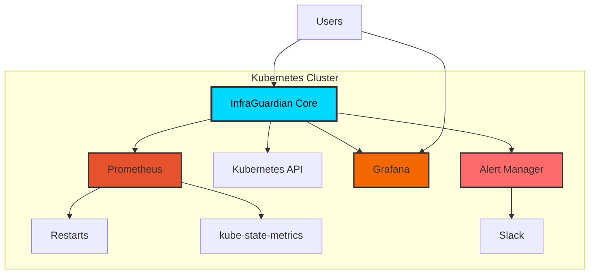

<div align="center">

# 🛡️ InfraGuardian


<p align="center">
  <strong>Kubernetes monitoring and anomaly detection system</strong>
</p>

<p align="center">
  
  
  
  
</p>


</div>

---
## 🌟 Features

<table>
<tr>
<td width="50%">

### 🔍 **Real-time Kubernetes Monitoring**
- Monitors Kubernetes **Pods, Nodes, Events**
- Tracks pod health continuously (CrashLoopBackOff, Pending, ImagePull errors)
- Fetches cluster events for issue detection
- Works **inside cluster** for continuous monitoring (no port-forward needed)

</td>
<td width="50%">

### 📈 **Prometheus Metrics & Insights**
- Prometheus-powered metrics collection
- CPU / Memory / Network / Disk metrics support
- Converts metrics into **actionable analytics**
- Automated Prometheus setup using **Helm** (no manual installation)

</td>
</tr>

<tr>
<td width="50%">

### 🤖 **Smart Problem Detection**
- Detects problematic workloads using pod status + events
- Identifies restart loops, failed scheduling, image pull failures
- Highlights frequently failing pods/services
- Helps debugging faster with event-based reasoning

</td>
<td width="50%">

### 📊 **Analytics Dashboard Ready**
- Metrics structured for dashboard integration
- Supports Grafana dashboards via Prometheus datasource
- Real-time + historical trend support
- Can be extended to export insights/reports

</td>
</tr>

<tr>
<td width="50%">

### 🔔 **Alert-Ready Architecture**
- Easily extendable to Slack / Email alerts
- Can integrate Alertmanager for notifications
- Suitable for SRE-style incident monitoring
- Designed for cluster failure prevention

</td>
<td width="50%">

### ⚙️ **Easy Deployment**
- Kubernetes manifests included (Deployment, Service, RBAC)
- One-command Prometheus setup via Helm
- Cluster-auth auto handled:
  - `loadFromCluster()` for in-cluster
  - `loadFromDefault()` for local testing
- Production-ready approach for Kubernetes environments

</td>
</tr>
</table>

---


## 🚀 Quick Start

<div align="center">
  
</div>

### Prerequisites

```bash
# Verify you have the required tools
kubectl version --client
helm version
git version
docker --version
```

### Installation

<details open>
<summary><b>📦 Deploy with Helm (Recommended)</b></summary>

```bash
# 1. Clone the repository
git clone https://github.com/your-org/infraguardian.git
cd infraguardian

# 2. Install InfraGuardian
helm install infraguardian ./infraguardian

# 3. Verify installation
kubectl get all -n infraguardian
```

**That's it! 🎉** InfraGuardian is now running in your cluster.

</details>

<details>
<summary><b>🐳 Custom Installation Options</b></summary>

```bash
# Install in specific namespace
helm install infraguardian ./infraguardian \
  --namespace monitoring \
  --create-namespace

# Install with custom values
helm install infraguardian ./infraguardian \
  -f custom-values.yaml

# Dry run to see what will be installed
helm install infraguardian ./infraguardian --dry-run --debug
```

</details>

---

## 🏗️ Architecture

<div align="center">



</div>

### 🔧 Components

| Component | Description | Technology |
|-----------|-------------|------------|
| **InfraGuardian Core** | Main monitoring engine | Node.js + Express |
| **Prometheus** | Metrics collection and storage | Prometheus |
| **Grafana** | Data visualization | Grafana |
| **Alert Manager** | Alert routing and management | Prometheus AlertManager |
| **Kubernetes API** | Cluster state monitoring | Kubernetes |

---


## 💡 Usage Examples

### Access the Dashboard

```bash
# Port forward to your local machine
kubectl port-forward -n infraguardian svc/infra-guardian-core 3000:3000

# Open in browser
open http://localhost:3000
```

### View Logs

```bash
# Stream application logs
kubectl logs -f -n infraguardian -l app=infra-guardian-core

# View last 100 lines
kubectl logs -n infraguardian -l app=infra-guardian-core --tail=100
```

### Scale Deployment

```bash
# Scale to 3 replicas
kubectl scale deployment infra-guardian-core -n infraguardian --replicas=3

# Verify scaling
kubectl get pods -n infraguardian
```

### Update Configuration

```bash
# Update with new values
helm upgrade infraguardian ./infraguardian -f new-values.yaml

# Rollback if needed
helm rollback infraguardian
```

---

## 🎨 Technology Stack

<div align="center">

<table>
<tr>
<td align="center" width="150">

<br><strong>Kubernetes</strong>
</td>
<td align="center" width="150">

<br><strong>Docker</strong>
</td>
<td align="center" width="150">

<br><strong>Helm</strong>
</td>
<td align="center" width="150">

<br><strong>Prometheus</strong>
</td>
<td align="center" width="150">

<br><strong>Grafana</strong>
</td>
</tr>
<tr>
<td align="center" width="150">

<br><strong>Node.js</strong>
</td>
<td align="center" width="150">

<br><strong>Express</strong>
</td>
<td align="center" width="150">

<br><strong>React</strong>
</td>
<td align="center" width="150">

<br><strong>JavaScript</strong>
</td>
<td align="center" width="150">

<br><strong>MongoDB</strong>
</td>
</tr>
</table>

</div>

---

## 🤝 Contributing

<div align="center">
  
</div>

We love contributions! 🎉 Here's how you can help:

<details>
<summary><b>🐛 Report Bugs</b></summary>

Found a bug? [Open an issue](https://github.com/your-org/infraguardian/issues/new?template=bug_report.md) with:
- Clear description
- Steps to reproduce
- Expected vs actual behavior
- Environment details

</details>

<details>
<summary><b>✨ Request Features</b></summary>

Have an idea? [Open a feature request](https://github.com/your-org/infraguardian/issues/new?template=feature_request.md) with:
- Use case description
- Proposed solution
- Alternative approaches

</details>


---


### 💖 Show Your Support

If you find InfraGuardian helpful, please consider:

⭐ **Starring** this repository  
🐦 **Sharing** on social media  
📝 **Writing** a blog post  
🗣️ **Speaking** at meetups  

---


<p>
<sub>Built with ❤️ by the InfraGuardian Team</sub>
</p>

<p>
<sub>⚡ Powered by Kubernetes | 🔥 Monitored by Prometheus | 📊 Visualized by Grafana</sub>
</p>

</div>